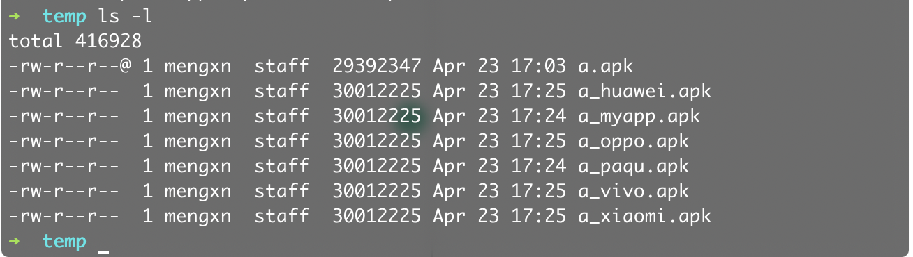

# 多渠道打包脚本
## 基本流程
1. 使用apktool解包apk文件
2. 修改AndroidManifest.xml文件内渠道信息
3. 使用apktool打包成（未签名）apk文件
4. 使用jarsigner或apksigner对apk文件进行签名

## 使用方法
`makeApkChannels.py [your path].apk`


## 配置
你需要编辑**makeApkChannels.py**文件，配置你自己的信息
``` python
channel_key = 'InstallChannel'
# you can add more channels
channels = ['myapp', 'xiaomi', 'huawei', 'vivo', 'oppo']
key_path = 'your key path'
key_alias = 'your key alias'
key_pass = 'your key password'
```
### 可选配置
- 将**makeApkChannels.py**文件放入系统环境下
- 为**makeApkChannels.py**文件附加可执行权限,`chmod a+x makeApkChannels.py`

你就可以在任何目录下执行此脚本了。

## 依赖库
- python3
- apktool
- apksigner

